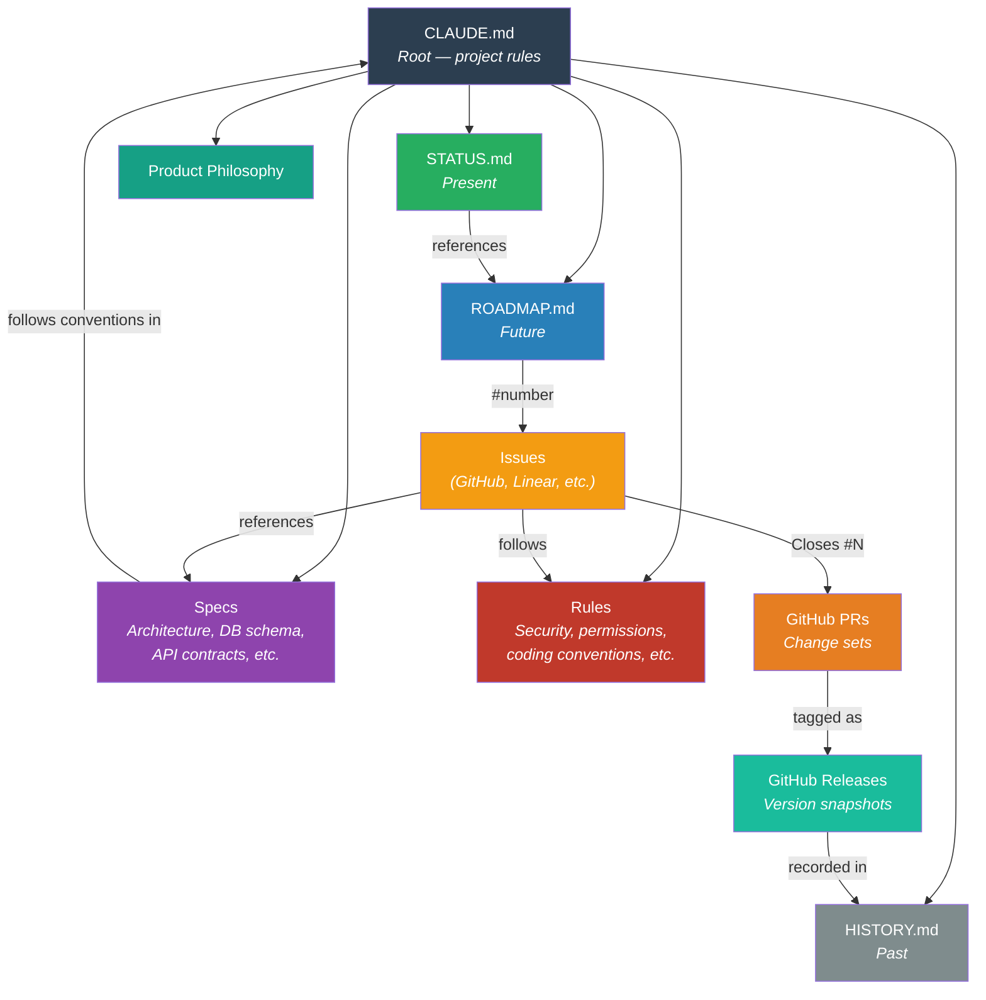
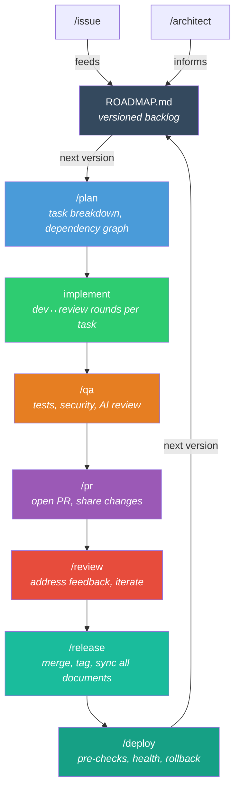
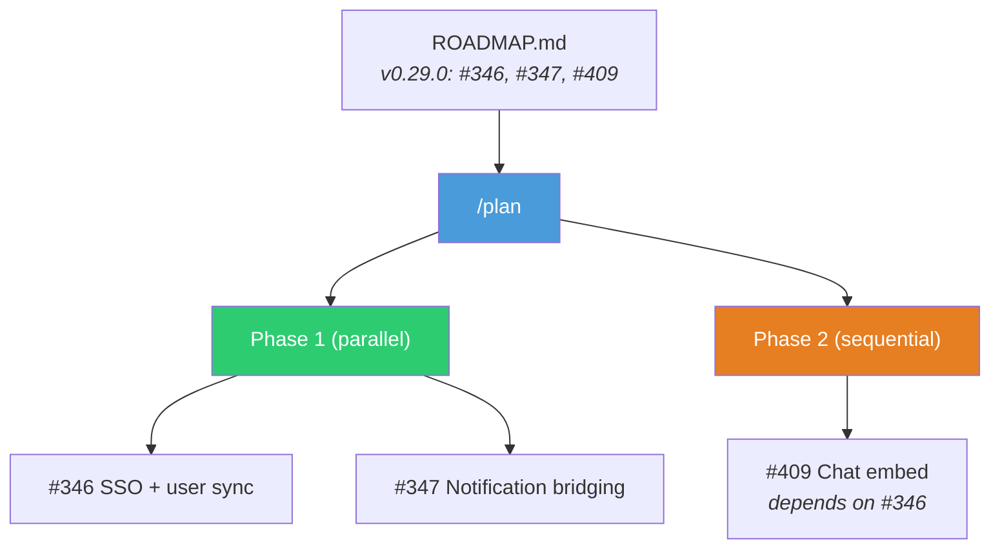
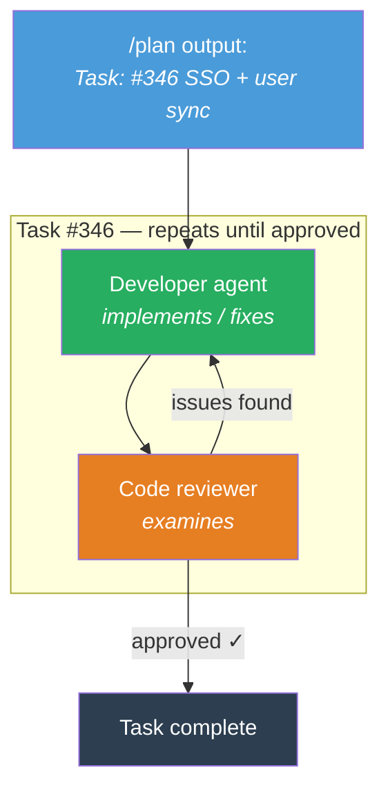
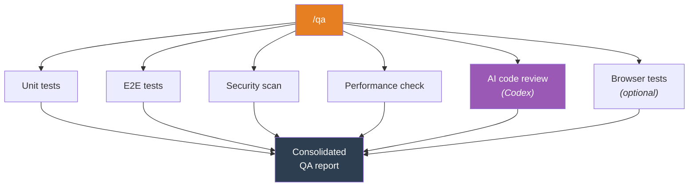
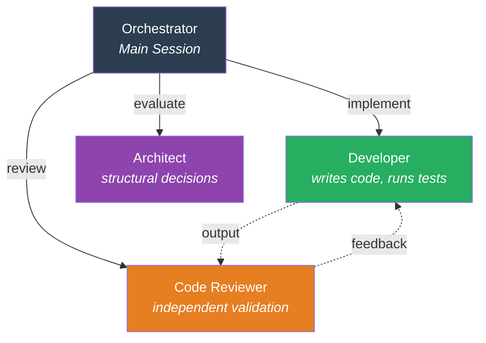

# How to Ride Your Horse

## Harness Engineering for Sustained Product Development

The bottleneck in AI-assisted development isn't the agent. It's the absence of a system for the agent to operate within.

AI coding agents are remarkably capable in a single session. But when you're building a product over months — releases, roadmaps, architectural decisions accumulating — the session-by-session model breaks down. The agent forgets. Process falls away. What works for a weekend project quietly erodes at month five.

There's growing attention on this problem. Anthropic wrote about [harness design for long-running apps](https://www.anthropic.com/engineering/harness-design-long-running-apps). Addy Osmani published [agent-skills](https://github.com/addyosmani/agent-skills) encoding engineering discipline into SDLC phases. Projects like [Everything Claude Code](https://github.com/affaan-m/everything-claude-code) are building comprehensive skill ecosystems. The focus is shifting from what the model can do to what the system around the model should look like.

I've been working on the same problem from a slightly different angle — not as a framework author, but as an engineer building a real product with Claude Code since last November. The agent is a powerful horse. Without a harness, you're not riding — you're holding on. Over six months, I tried many things, discarded most, and kept what worked.

This document presents three ideas that emerged from that experience: a **document graph** that gives the agent persistent memory across sessions, an **SDLC skill pipeline** that encodes an entire development methodology as chained skills, and a **delegation pattern** where the structure itself forces explicitness — which turned out to matter more than the automation.

---

### The Document Graph

This is the idea I spent the most time on, and the one that changed the agent's behavior the most.

Most projects put everything in one CLAUDE.md. Early on, mine was over 1,000 lines. The agent cited outdated information from the top while ignoring updates at the bottom. Context was there, but it was a wall.

So I started splitting. And once I started, a structure emerged — a graph of documents, each with a single responsibility:



Three layers:

- **Temporal** — STATUS (present), ROADMAP (future), HISTORY (past), README (always). Split by *when*.
- **Domain** — Specs (architecture, DB schema, API contracts) and Rules (security, permissions, coding conventions, product philosophy). Split by *what*. The specific documents vary by project — what matters is that each holds one concern.
- **Detail** — Issues (GitHub, Linear, or any tracker), PRs, and Releases. Issues carry work items; PRs carry change sets that close issues; Releases tag version snapshots that feed into HISTORY. These are platform-native tools, but in this harness the agent reads and writes them as part of the methodology — `/issue` creates them, `/pr` packages them, `/release` tags and records them. ROADMAP links to issues by number but doesn't duplicate content, keeping it lean.

Here's what this looks like in practice. These are real excerpts from the project, lightly abstracted:

**CLAUDE.md** (root — links to everything, contains only project-level rules):
```markdown
> **Project:** [README.md](./README.md) | **Status:** [STATUS.md](./docs/STATUS.md) | **Roadmap:** [ROADMAP.md](./docs/ROADMAP.md)

## Dev Commands
- Backend: `./gradlew build -x test`
- Frontend: `pnpm dev`

## Rules
- Main session is the orchestrator. MUST NOT edit code directly.
- Conventional Commits. 120 char max line length.
```

**STATUS.md** (present — what's happening now):
```markdown
**Status:** v0.28.0 RELEASED — Next: v0.29.0
**Current Version:** v0.28.0

## System Health
| Metric         | Status              |
|----------------|---------------------|
| Backend Tests  | 1,265 passed        |
| Frontend Tests | 1,825 passed        |
| E2E Tests      | 225 passed          |
| Docker         | 7/7 healthy         |
```

**ROADMAP.md** (future — what's planned, by version):
```markdown
**Current Version:** v0.28.0 (Released)
**Next Version:** v0.29.0 (Messenger Integration)

## Upcoming Releases

### v0.29.0 - Messenger Integration ⬅️ Next
| Issue | Description           | Area  |
|-------|-----------------------|-------|
| #346  | SSO + user sync       | BE    |
| #347  | Notification bridging | BE    |
| #409  | Chat embed + shortcut | FE+BE |

### v0.30.0 - HR Integration
| Issue | Description          | Area |
|-------|----------------------|------|
| #410  | HR system API sync   | BE   |
```

**HISTORY.md** (past — auto-populated by `/release`):
```
v0.28.0 (04-10): Multi-Tenant + Licensing + Theming   ⬅️ Latest
v0.27.0 (03-22): Security Hardening
v0.26.0 (03-21): Auth & Access Control
v0.25.0 (03-20): Notification Settings + File Monitoring
v0.24.0 (03-15): AI Feature Intake Pipeline
...
```

Notice how each document does one thing. ROADMAP doesn't explain what v0.28.0 contained — that's HISTORY's job. STATUS doesn't list future plans — that's ROADMAP's job. ROADMAP references issues by number (`#346`, `#347`) but doesn't duplicate the issue body. The details live in issues (GitHub, Linear, or whatever tracker you use), which in turn reference Architecture.md or API specs when relevant.

There are circular references. That's fine — in documentation, unlike in code, a cycle means "these things are related." What matters is that each node holds minimal, authoritative data for one concern.

If you work with distributed systems, the framing is direct: each document is a service with a single source of truth. Skills are event-driven propagators that maintain consistency. `/release` is the synchronization event — when I shipped v0.28.0, the release skill updated STATUS (version, health), ROADMAP (moved completed items, shifted the "Next" marker), and HISTORY (added the changelog) in one pass. No human touched any of them.

The payoff: when the agent starts a new session and reads these documents, it doesn't just have context — it has trajectory. What was tried, what shipped, what's planned, what's blocked.

---

### The Skill Pipeline — SDLC-as-Skills

Most setups give the agent a bag of independent skills. This harness encodes the entire SDLC as a versioned release cycle:



Everything is versioned. ROADMAP organizes work by target version. `/plan` scopes a version. `/release` tags it and moves the "Next" marker forward. The cycle repeats per version.

The backlog skills — `/issue` and `/architect` — feed items into ROADMAP at any point, slotted into the right version by priority. The full loop: **decide → plan → build → verify → release → decide again.**

The diagram looks simple. The interesting parts are inside each stage.

---

#### `/plan` — Task Breakdown

`/plan` reads ROADMAP for the target version's issues, investigates the codebase, and produces a plan: tasks with a dependency graph, grouped into parallel and sequential phases.



The plan is the contract for everything that follows. It reads the target version's issues from ROADMAP, investigates the codebase, and produces a dependency graph: #346 and #347 can run in parallel (no dependency), but #409 needs SSO from #346 first.

---

#### Implementation — How a Task Executes

Implementation isn't a separate skill — it's the execution of what `/plan` produced. Each task from the plan becomes a unit of work: developer agent + code reviewer agent, looping until the work meets quality.



The number of rounds isn't fixed — a simple task might pass on round 1, a complex one might take three or four. The reviewer and developer iterate until the reviewer has no more issues.

When all tasks from the plan are complete, the orchestrator (me) decides when to move to `/qa`. It's not automatic — I review the aggregate state, make sure the pieces fit together, and then invoke `/qa` explicitly. For versions with multiple tasks, independent tasks run in parallel and dependent tasks run in order, following the dependency graph from `/plan`.

---

#### `/qa` — Parallel Verification

Once implementation is complete, `/qa` runs all checks in parallel:



A single consolidated report comes out. Nothing moves to `/pr` until all checks pass. Failures get routed back to the developer agent for fixing.

> [!NOTE]
> **When issues emerge mid-cycle** — The pipeline isn't always a clean forward pass. During `/qa` or `/review`, new issues surface. What happens next depends on severity:
> - **Critical** — loop back to `/plan` for a scoped fix before proceeding.
> - **Non-critical** — `/issue` files it into ROADMAP at the right priority, picked up in the next patch version. The current cycle continues unblocked.
>
> The backlog skills aren't just for intake — they're the escape valve that keeps the pipeline focused.

---

#### `/pr` — Package the Changes

`/pr` analyzes the committed changes, drafts a structured Pull Request, and opens it on GitHub.

What it does:
- Reads `git diff` and `git log` to understand what changed
- Writes a PR description: summary, related issues (`Closes #346, #347, #409`), test plan
- Links the PR to the relevant ROADMAP version
- Opens the PR via `gh pr create`

The PR becomes the formal handoff point — everything before it was internal iteration, everything after is shared with the team (or with future-me reviewing in a month).

---

#### `/review` — Process Feedback

Once a PR is open, feedback comes in — from human reviewers, CI checks, or AI code review (Codex/Copilot). Issues found here follow the same mid-cycle pattern as `/qa`: critical findings loop back for immediate fixing, non-critical ones get filed via `/issue` into the next patch version. The current PR doesn't get blocked indefinitely by scope creep.

---

#### `/release` — The Synchronization Event

This is where the document graph pays off. `/release` does several things in one pass:

1. **Merge safety check** — verifies the PR is approved and CI passes
2. **Merge** — squash-merges the PR, deletes the feature branch
3. **Tag** — creates a git tag (e.g., `v0.29.0`)
4. **GitHub Release** — publishes release notes with changelog
5. **Document cascade** — updates the entire document graph:
   - STATUS.md → new version number, updated health
   - ROADMAP.md → completed items removed, "Next" marker shifts forward
   - HISTORY.md → new release entry with date and changelog
6. **Close issues** — any issues not auto-closed by the PR get closed manually

One skill invocation, all documents synchronized. No manual step to forget, no stale changelog accumulating.

---

#### `/deploy` — Ship to Environment

`/deploy` handles the final step: getting the tagged release onto the target server.

What it does:
1. **Pre-deploy checklist** — verifies clean working tree, all tests passing, correct branch
2. **Execute deployment** — runs the deploy script
3. **Health monitoring** — polls the health endpoint until the service responds (or times out)
4. **Smoke test** — basic login/page-load verification
5. **Rollback readiness** — if health check fails, provides the rollback command

The key insight: deployment isn't just "push code." It's a verification step with its own success criteria. The skill encodes those criteria so they happen every time, not just when I remember to check.

Then the cycle starts again with the next version.

---

### Delegation and Explicitness

Early on, the main session did everything — planned, wrote code, reviewed its own work. It worked for small tasks. At scale, it failed: deep in implementation, the agent would forget the plan it had made twenty messages ago.

So I split the roles. The main session orchestrates — plans, delegates, communicates with me. It never writes code. The developer agent implements. The code reviewer examines the work independently.



Anthropic's engineering blog describes a useful principle: separate the entity that generates work from the entity that evaluates it. Self-evaluation is unreliable because the evaluator shares the same context and biases as the generator. External evaluation is tunable.

But the insight I didn't expect was this: **the biggest quality improvement wasn't role separation itself — it was the explicitness that delegation demands.**

When the orchestrator delegates a task, it can't just "start coding." It has to articulate what the task is, what files are relevant, what the expected behavior should be, and what constraints apply. That articulation — forced by the structure, not by discipline — catches ambiguity before it becomes a bug. Requirements that lived as vague intent in my head became explicit statements in the delegation prompt.

Looking back, this is the single thing that improved output quality the most. The roles are useful, the pipeline is useful, the documents are useful. But the act of having to *say what you want, precisely, every time* — that's where the real leverage was.

---

### What Didn't Work

Not everything survived:

- **Running many dev sessions in parallel.** I tried spinning up multiple independent development sessions — different features building simultaneously. It looked impressive: several terminals with agents churning away across my monitors. But it was chess simultaneous exhibition, and I'm not Magnus Carlsen. Simple tasks could run in parallel fine. Anything with real complexity needed my review, my direction, my judgment calls — and I couldn't context-switch fast enough to serve three or four of them well. The agent wasn't the bottleneck; I was. I settled on parallel *tasks within one session* (the orchestrator managing multiple developer agents on independent work), but the *session itself* stays serial. Testing shares one environment, and agents coordinate access rather than fighting over ports.
- **Detailed ROADMAP entries.** Early versions had full task descriptions inline. By month three, the document was unreadable. Moving detail to GitHub issues and keeping ROADMAP as an index — just issue numbers and one-line titles — was the fix.
- **Letting the orchestrator write "just small fixes."** Every exception eroded the pattern. Once the rule became absolute — no code edits from the main session, ever — the workflow stabilized. The cost of delegating a one-line fix is low. The cost of a leaky abstraction is high.

---

### Where This Lands

There's a progression in how people work with AI coding agents. First, the craft was in writing good prompts. Then, in curating what context to put in front of the model. Now, increasingly, the leverage is in what surrounds the model — the scaffold.

A scaffold is everything the model doesn't provide itself: tool access, memory, evaluation loops, process enforcement. The model generates. The scaffold shapes what gets generated, verifies it, and carries state forward. A prompt disappears after one turn. A scaffold persists.

Skills, documents, agents, hooks — these are scaffold components. This harness is one way to assemble them into something that holds up over months of product development. The underlying bet: investing in scaffold compounds over time. Ad-hoc prompting decays.

And if I had to point at one thing: teach your agent to demand explicitness from you. The structure that forces you to articulate what you want is worth more than the structure that automates what you don't.

---

### References

- [Anthropic — Harness Design for Long-Running Apps](https://www.anthropic.com/engineering/harness-design-long-running-apps) — Multi-agent evaluation separation
- [Addy Osmani — Agent Skills](https://github.com/addyosmani/agent-skills) — SDLC-phase skills with verification gates
- [Everything Claude Code](https://github.com/affaan-m/everything-claude-code) — Comprehensive skill ecosystem
- [Evolution of AI Agentic Patterns](https://bits-bytes-nn.github.io/insights/agentic-ai/2026/04/05/evolution-of-ai-agentic-patterns.html) (KR) — From prompt engineering to harness engineering

### Using This

→ [Setup Guide](docs/GUIDE.md)

---

Built by [Junu Jeon](https://www.linkedin.com/in/junu-jeon). Thanks to [Seoyoon Jin](https://www.linkedin.com/in/seoyoon-jin/) for encouraging me to share this.

MIT License.
